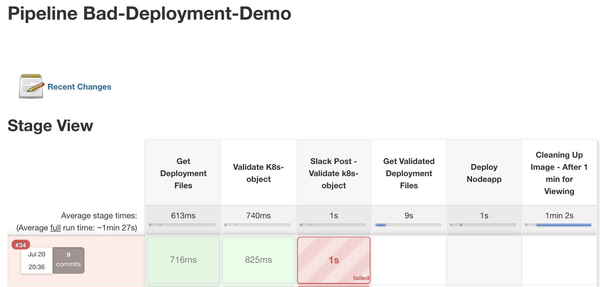
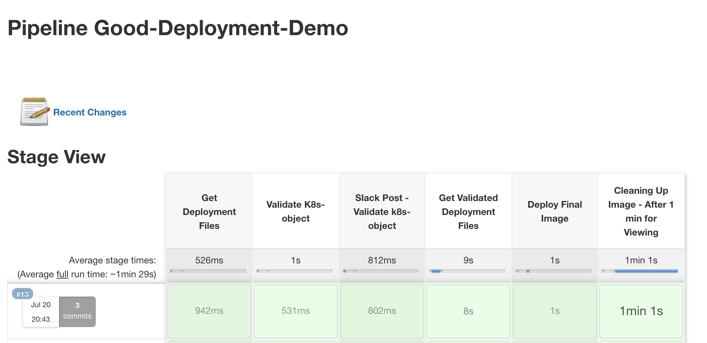

# CBC Container Demo artifacts

This demos two Jenkins-K8s deployments. It is intended to be imported, and work seamlessly, into the [CBC Container CI/CD Demo](https://github.com/ncomeau/CBC_Container_CICD_Demo) with minimal configuration. For more information regarding the process for importing this pipeline, please view the [K8Configs Main Branch Readme.md](https://github.com/JaBarosin/K8sConfigs/tree/main).


## Bad-deployment
  - Jenkinsfile and deployment.yaml that violate CB Container policy rules
  - Pipeline Config for ***bad-deployment-pipeline***:
  
  Pipeline config | Value
--------------------- | ---------------------
Pipeline Definition: | Pipeline script from SCM
SCM: | Git
Repositories - Reposiroty URL: | ```https://github./com/JaBarosin/K8sConfigs.git```
Credentials: | _none_
Branches to build - Branch specifier: | ```*/CBC_Container_Demo```
Repository Browser: | (Auto)
Script Path: | ```bad/Jenkinsfile```

  


## Good-deployment
  - Jenkinsfile and deployment-v2.yaml updated with additional configurations to satisfy CB Container policy rules
  - Pipeline Config for ***good-deployment-pipeline***:

Pipeline config | Value
--------------------- | ---------------------
Pipeline Definition: | Pipeline script from SCM
SCM: | Git
Repositories - Reposiroty URL: | ```https://github./com/JaBarosin/K8sConfigs.git```
Credentials: | _none_
Branches to build - Branch specifier: | ```*/CBC_Container_Demo```
Repository Browser: | (Auto)
Script Path: | ```good/Jenkinsfile```

  
